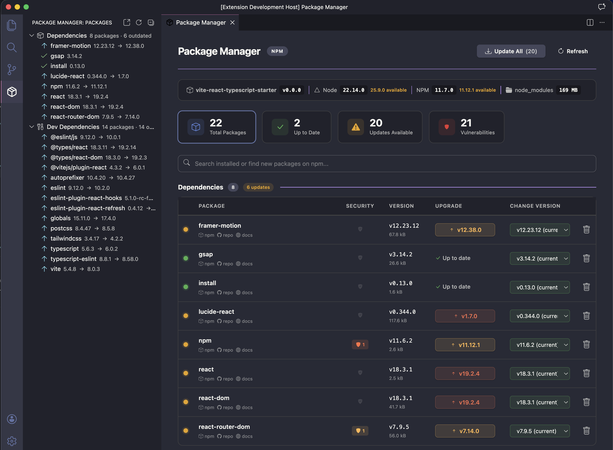

# NPM Manager

**NPM Manager** is a powerful Visual Studio Code extension that gives you a beautiful, intuitive visual interface to manage all your project dependencies — without ever touching the terminal.

Supports **npm**, **yarn**, **pnpm**, and **bun**.

---

## Features

### Package Overview

- **Visual Dashboard** — Clean webview panel showing all your dependencies and devDependencies at a glance
- **Sidebar Tree View** — Quick-access tree view in the activity bar with colored status indicators
- **Environment Info Bar** — See your project name, version, Node.js version, package manager version, and `node_modules` size — all in one place
- **Stats Cards** — Interactive stat cards showing total packages, up-to-date count, and available updates — click to filter

### Smart Upgrades

- **Color-Coded Update Buttons** — Instantly see the impact of each update:
  - **Green** for patch updates (bug fixes — safe to update)
  - **Amber** for minor updates (new features — backward compatible)
  - **Coral** for major updates (breaking changes — review docs first)
- **Hover Tooltips** — Hover any upgrade button to see a helpful hint about the update type with a contextual icon
- **Update All** — One-click bulk update for all outdated packages
- **Stable Versions Only** — Beta, RC, alpha, canary, and other pre-release versions are automatically filtered out from upgrade suggestions

### Version Management

- **Bundle Size** — Each package shows its gzipped bundle size above the version, fetched from bundlephobia in the background
- **Change Version Dropdown** — Browse all stable versions of any package in a single dropdown to upgrade or downgrade
- **Clean Version Display** — Long version strings like `5.1.0-rc-fb9a90fa48-20240614` are shortened to `v5.1.0` for readability, with a `v` prefix on all versions
- **Smart Version Limiting** — When a package has hundreds of versions, the list is intelligently sampled to keep it under 20 items
- **Version Prefetching** — All available versions are fetched in the background so dropdowns are ready instantly

### Package Installation

- **NPM Registry Search** — Search for new packages directly from the search bar with real-time results
- **One-Click Install** — Install any package as a dependency or dev dependency with dedicated buttons
- **Search Caching** — Previously searched queries are cached for instant results

### Package Removal

- **Safe Uninstall** — Trash icon with a two-step confirmation to prevent accidental removals

### Search & Filter

- **Real-Time Search** — Filter installed packages by name as you type
- **Status Filtering** — Click stat cards to show only up-to-date or outdated packages
- **Combined Search** — Search bar works for both installed packages and npm registry simultaneously

### Auto Detection & Refresh

- **Auto-Detect Package Manager** — Automatically detects npm, yarn, pnpm, or bun based on lock files in your project
- **File Watcher** — Watches `package.json` for changes and refreshes the UI automatically
- **Cached Data** — Panel loads instantly with cached data while fresh data is fetched in the background

### Security Audit

- **Vulnerability Scanning** — Runs `npm audit` (or equivalent for yarn/pnpm/bun) in the background to detect known vulnerabilities
- **Security Column** — Each package shows a shield icon: green checkmark if safe, or a colored badge with vulnerability count if issues are found
- **Severity Levels** — Vulnerabilities are color-coded: critical (red), high (orange), moderate (amber), low (grey)
- **Click for Details** — Click any vulnerability badge to see a popover listing each issue with severity level, title, and link to the advisory
- **Security Stat Card** — A dedicated stat card shows the total count of vulnerable packages — click to filter the table

### Duplicate Detection

- **Duplicate Warning** — If the same package appears in both `dependencies` and `devDependencies`, a small amber "duplicate" badge is shown next to the package name

### Package Details

- **Quick Links** — Each package shows small npm, repo, and docs links directly below the name
- **Click for Details** — Click any package name to open a popover with the package description, version, type badge, latest version info, and links to npm, GitHub, and homepage
- **Package Descriptions** — Fetched from the npm registry and shown in the popover

### Developer Experience

- **Theme Aware** — Follows your VS Code theme (light and dark) seamlessly with soft, non-distracting colors
- **Scroll Preservation** — Your scroll position is maintained when the package list refreshes
- **Input Validation** — Package names and versions are validated to prevent command injection

---

## Installation

1. Open **VS Code**
2. Go to the **Extensions** panel (`Ctrl+Shift+X`)
3. Search for **NPM Manager**
4. Click **Install**

Or install from the [Visual Studio Marketplace](https://marketplace.visualstudio.com/items?itemName=MdRashid.npm-manager).

## Preview

## Supported Package Managers

| Manager | Lock File                | Status          |
| ------- | ------------------------ | --------------- |
| npm     | `package-lock.json`      | Fully supported |
| yarn    | `yarn.lock`              | Fully supported |
| pnpm    | `pnpm-lock.yaml`         | Fully supported |
| bun     | `bun.lockb` / `bun.lock` | Fully supported |

## Also by the Author

### [TabAutoPilot — Smart Tab Manager](https://chromewebstore.google.com/detail/tabautopilot-smart-tab-ma/nplekjmldglpfcdiechmgahoefhfheom?utm_source=item-share-cb)

A **free** AI-powered Chrome extension that automatically organizes, names, and cleans up your browser tabs — all on-device, with zero data collection.

- **Smart Grouping** — AI analyzes tab titles to categorize by topic, not just domain
- **Duplicate Detection** — Find and remove duplicate tabs in one click
- **Tab Hibernation** — Free memory by discarding inactive tabs
- **Workspaces** — Save and restore complete tab sessions
- **Memory Dashboard** — Track memory savings over 30 days
- **100% Private** — No accounts, no external APIs, all processing happens locally via Chrome's built-in AI

[Install TabAutoPilot for Free →](https://chromewebstore.google.com/detail/tabautopilot-smart-tab-ma/nplekjmldglpfcdiechmgahoefhfheom?utm_source=item-share-cb)

---

## License

This extension is free to use. All rights reserved.

See [LICENSE](LICENSE) for details.

---

## Author

**Mamunur Rashid** — Senior Software Engineer with 10+ years of experience in web development, specializing in dynamic CMS-based and custom web applications.

**Tech Stack:** PHP, Laravel, Node.js, TypeScript, Vue.js, React.js, C#/.NET, MySQL, PostgreSQL, Docker, AWS

[Website](https://mdrashid.com) · [GitHub](https://github.com/rocke3) · [LinkedIn](https://linkedin.com/in/rfmamun) · [Fiverr](https://fiverr.com/mamunurrashi461)
